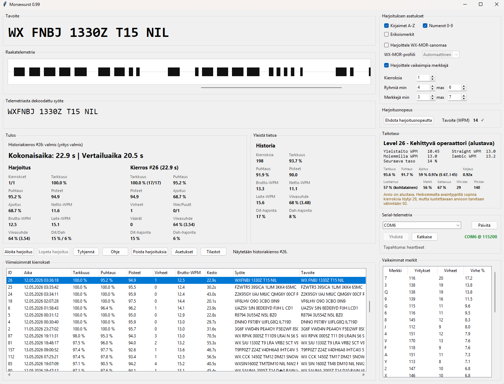

# MorseWurst

MorseWurst is a Python-based desktop training application for practising Morse code with the MorseWurst Keyer.

The application receives real-time keying telemetry from the keyer, decodes the signal, measures sending accuracy and timing quality, and gives detailed feedback about Morse performance. The goal is to make Morse practice measurable, visible and easier to improve over time.



## Current status

MorseWurst is under active development and is now usable as a serious local Morse training application.

The core local training workflow is functional and continues to be refined. The project also includes network practice features, update-checking infrastructure and experimental online components that will be developed further over time.

## Main features

- Real-time Morse input from the MorseWurst Keyer
- Adaptive decoding based on the user's sending rhythm
- Profile-aware timing analysis
- Accuracy, cleanliness, speed and timing scoring
- Dot, dash and gap analysis
- Training rounds with generated target text
- Problem character practice
- Skill and progress tracking
- Practice history stored locally
- WX-MOR practice mode for weather-oriented Morse training
- Experimental network practice support
- Windows-oriented desktop use
- Update-checking support through a remote manifest

## Requirements

- Python 3.11 or newer recommended
- A MorseWurst Keyer or compatible serial telemetry source
- Windows is the main development target

Install Python dependencies with:

```
pip install -r requirements.txt
```

## Running the application

From the project root:

```
python main.py
```

On Windows, you can also use:

```
.\run.ps1
```

## Development setup

Create and activate a virtual environment:

```
python -m venv .venv
.\.venv\Scripts\Activate.ps1
pip install -r requirements.txt
```

Then start the program:

```
python main.py
```

## Building on Windows

The project includes a Windows build script:

```
.\build_windows.ps1
```

Build and installer tooling are part of the project workflow and may continue to evolve as the application matures.

## MorseWurst Keyer firmware and build documentation

The ESP32-S3 firmware for the MorseWurst Keyer is included in the repository.

The Arduino firmware source can be found in:

```text
docs/Arduino/morsewurst_keyer/
```

The main firmware file is:

```text
morsewurst_keyer.ino
```

Build instructions, hardware notes and setup documentation for the keyer can be found in:

```text
docs/Morsewurst_keyer_build_manual.md
```

and in Finnish:

```text
docs/Morsewurst_keyer_rakennusohje.md
```


## Project structure

```text
morsewurst/
  core/        Morse decoding, adaptive timing, scoring and training logic
    wxmor/     WX-MOR weather-oriented Morse training data and logic
  hardware/    Serial input from the MorseWurst Keyer
  network/     Network practice client logic
  server/      Relay server components
  storage/     Local database handling
  ui/          Tkinter user interface, panels and controllers
Assets/        Sounds, images and application assets
main.py        Application entry point
```

## Network features

MorseWurst includes network practice support for connecting users through a relay server. The network system is already present in the application and is being actively developed, but it should still be treated as an evolving feature compared with the local training workflow.

## Updates

MorseWurst can check for updates by reading a small remote JSON manifest. The first version of the update system only notifies the user when a newer version is available and opens the release or download page in the browser.

It does not yet download or install updates automatically.

## Data and privacy

MorseWurst stores practice history locally on the user's computer.

Network features may send real-time practice-related telemetry through the configured relay server when the user chooses to use network practice. Local training does not require network access.

## Roadmap

Future development is expected to focus on:

* Further improving network practice
* Expanding training modes
* Refining the update workflow
* Improving Windows packaging and release handling
* Adding more diagnostics and troubleshooting tools
* Improving documentation as the project continues to stabilize

## License

See `license_fi.txt`.