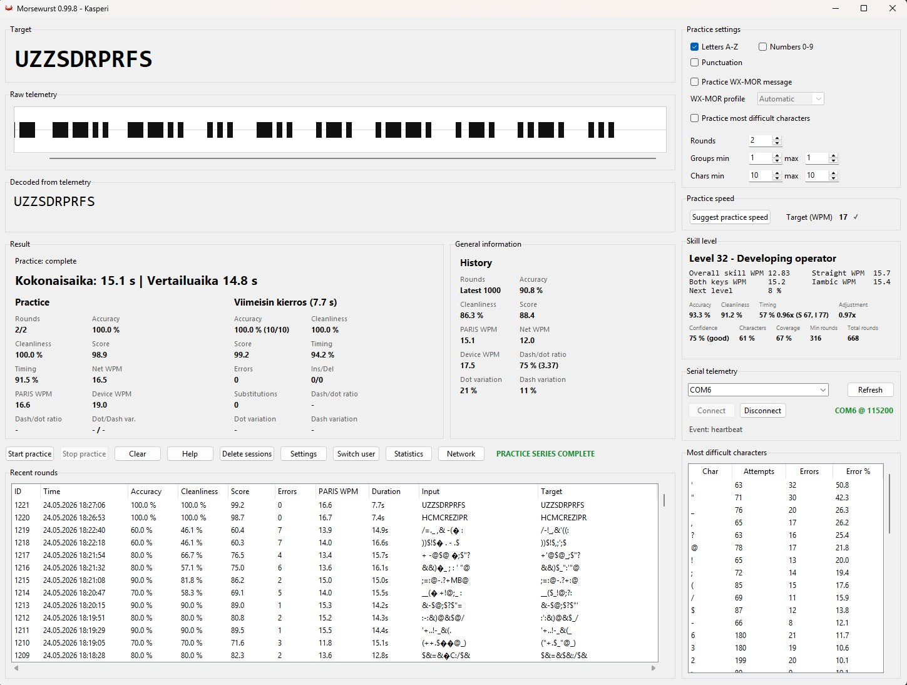
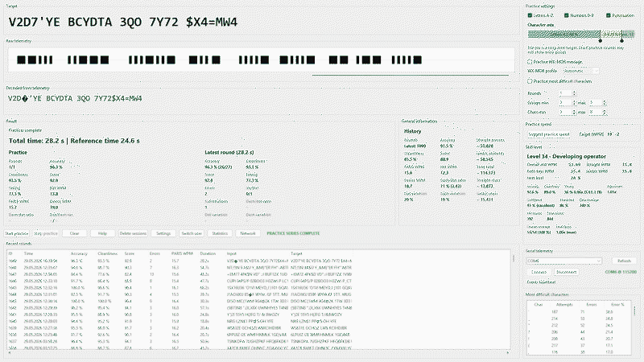
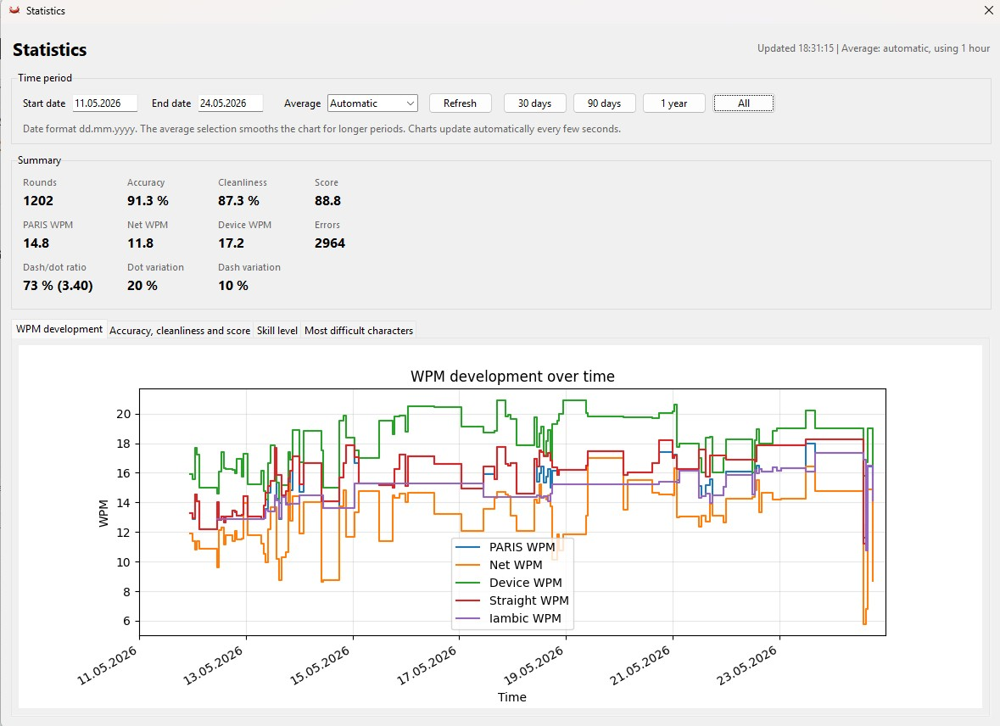
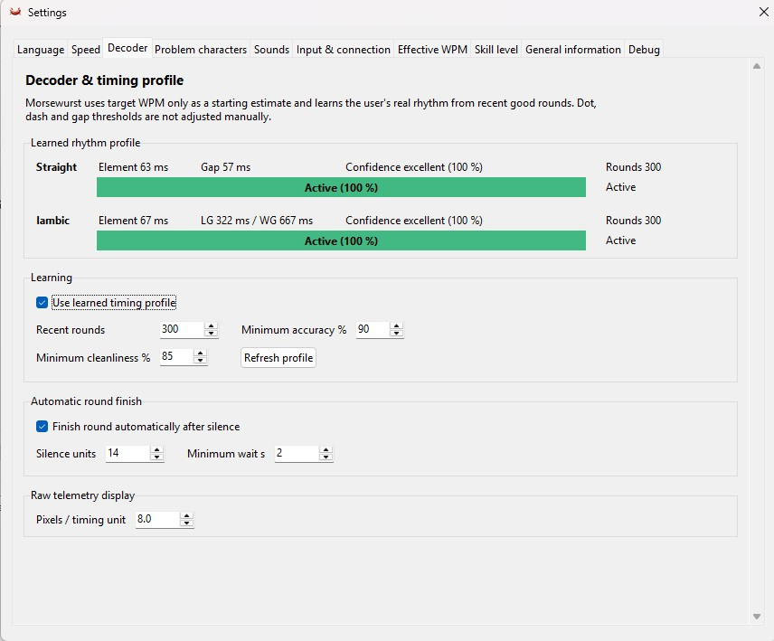

- [1. Current status](#1-current-status)
- [2. Main features](#2-main-features)
- [3. Network features](#3-network-features)
- [4. Screenshots](#4-screenshots)
  - [4.1. Main practice window](#41-main-practice-window)
  - [4.2. Network lobby](#42-network-lobby)
  - [4.3. Statistics](#43-statistics)
  - [4.4. Settings](#44-settings)
- [5. Requirements](#5-requirements)
- [6. Running the application](#6-running-the-application)
- [7. Development setup](#7-development-setup)
- [8. Testing](#8-testing)
- [9. Building on Windows](#9-building-on-windows)
- [10. Morsewurst Keyer firmware and build documentation](#10-morsewurst-keyer-firmware-and-build-documentation)
- [11. Project structure](#11-project-structure)
- [12. Updates](#12-updates)
- [13. Data and privacy](#13-data-and-privacy)
- [14. Coming next](#14-coming-next)
- [15. License](#15-license)

# Morsewurst

Morsewurst is a Python-based desktop training application for practising Morse code with the Morsewurst Keyer.

The application receives real-time keying telemetry from the keyer, decodes the signal, measures sending accuracy and timing quality, and gives detailed feedback about Morse performance. The goal is to make Morse practice measurable, visible and easier to improve over time.


## 1. Current status

Morsewurst is under active development and is now usable as a serious local Morse training application.

The core local training workflow is functional and continues to be refined. The project also includes network practice features, update-checking infrastructure and experimental online components that will be developed further over time.

## 2. Main features

- Real-time Morse input from the Morsewurst Keyer
- Adaptive decoding based on the user's sending rhythm
- Profile-aware timing analysis
- Accuracy, cleanliness, speed and timing scoring
- Dot, dash and gap analysis
- Training rounds with generated target text
- Problem character practice
- Koch receive practice with guided progression, manual stages, full-character-set drills and local copy scoring
- Skill and progress tracking
- Practice history stored locally
- WX-MOR practice mode for weather-oriented Morse training
- Morsewurst Network for online practice through a relay server
- Network quality indicator with ping and jitter-buffer feedback
- Windows-oriented desktop use
- Update-checking support through a remote manifest

## 3. Network features

Morsewurst includes network practice support for connecting users through a relay server. Users can join public rooms or create private rooms and exchange real-time Morse tone telemetry.

The network system includes relay-side room handling, client reconnect logic, ping and server status checks, jitter-buffered receive playback and a visible network quality indicator. Morsewurst Network is still an actively developed prototype, so occasional glitches and unexpected behaviour may occur.

Network receive playback can also include local radio-style channel noise, with configurable noise profile, tone and level settings. This is intended to make online Morse practice feel closer to listening through a real radio channel while keeping the actual transmitted Morse telemetry clean.

## 4. Screenshots

### 4.1. Main practice window



### 4.2. Network lobby



### 4.3. Statistics



### 4.4. Settings



## 5. Requirements

- Python 3.13 recommended
- Python 3.11 or newer should work, but the project is currently developed and tested mainly with Python 3.13
- A Morsewurst Keyer or compatible serial telemetry source
- Windows is the main development target

Python itself is not installed by `requirements.txt`. Install Python first, then install the project dependencies.

On Windows, Python 3.13 can be installed from the terminal with:

```powershell
winget install Python.Python.3.13
```

Check that Python is available:

```powershell
py -3.13 --version
```

Install Python dependencies with:

```powershell
py -3.13 -m pip install -r requirements.txt
```

## 6. Running the application

From the project root:

```powershell
python main.py
```

On Windows, you can also use:

```powershell
.\run.ps1
```

## 7. Development setup

Create and activate a virtual environment:

```powershell
py -3.13 -m venv .venv
.\.venv\Scripts\Activate.ps1
python -m pip install --upgrade pip
python -m pip install -r requirements.txt
```

Then start the program:

```powershell
python main.py
```

## 8. Testing

The project includes a pytest-based regression suite for the core Morse logic, adaptive decoding, scoring, timing profiles, WX-MOR generation, settings handling, network protocol validation, jitter-buffer scheduling and relay integration.

Install development and test dependencies with:

```powershell
python -m pip install -r requirements-dev.txt
```

Run all tests from the project root:

```powershell
python -m pytest
```

## 9. Building on Windows

The project includes a Windows build script:

```powershell
.\build_windows.ps1
```

Build and installer tooling are part of the project workflow and may continue to evolve as the application matures.

## 10. Morsewurst Keyer firmware and build documentation

The ESP32-S3 firmware for the Morsewurst Keyer is included in the repository.

The Arduino firmware source can be found in:

```text
docs/Arduino/morsewurst_keyer/
```

The main firmware file is:

```text
morsewurst_keyer.ino
```

Build instructions, hardware notes and setup documentation for the keyer can be found in:

```text
docs/Morsewurst_keyer_build_manual.md
```

and in Finnish:

```text
docs/Morsewurst_keyer_rakennusohje.md
```

## 11. Project structure

```text
morsewurst/
  core/        Morse decoding, adaptive timing, scoring and training logic
    wxmor/     WX-MOR weather-oriented Morse training data and logic
  hardware/    Serial input from the Morsewurst Keyer
  network/     Network practice client logic
  server/      Relay server components
  storage/     Local database handling
  ui/          Tkinter user interface, panels, windows and controllers
assets/        Sounds, images and application assets
docs/          Firmware, screenshots, update manifest and documentation
server/        Relay server deployment helpers
tests/         Pytest regression and integration tests
main.py        Application entry point
```

## 12. Updates

Morsewurst can check for updates by reading a small remote JSON manifest. The first version of the update system only notifies the user when a newer version is available and opens the release or download page in the browser.

It does not yet download or install updates automatically.

## 13. Data and privacy

Morsewurst stores practice history locally on the user's computer.

Network features may send real-time practice-related telemetry through the configured relay server when the user chooses to use network practice. Local training does not require network access.

## 14. Coming next

Future development is expected to focus on making Morsewurst Network more reliable, more useful and easier to use for real online Morse practice.

Planned and ongoing work includes:

- Further improving network practice and online room features
- Making network connection handling, reconnecting and diagnostics clearer
- Adding more training modes
- Improving the update workflow so the application can eventually update itself
- Adding better diagnostics and troubleshooting tools
- Keeping the documentation clearer and more up to date, including small cleanups like this one

## 15. License

See `license_fi.txt`.